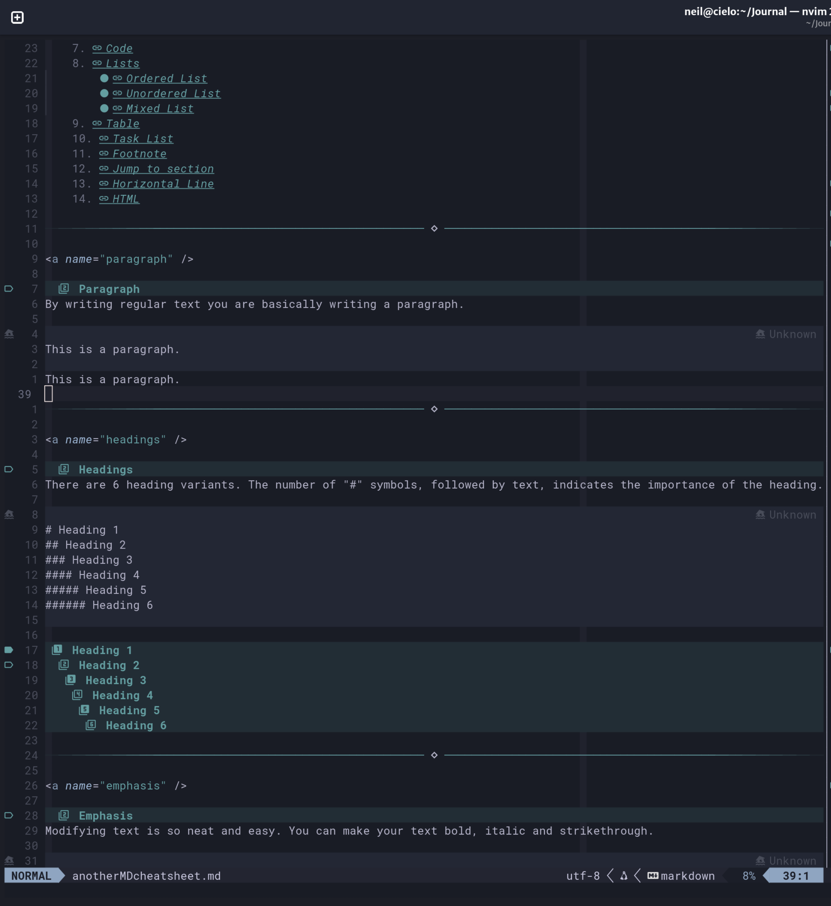

# nvim config in Lua
Neovim config files, simplified to take advantage of nvim r0.11 features in F42.

I'm not sure Neovim makes me faster, because "tinker-time".
But I do know that Neovim makes me happy, and that should count for something.

No UserName folder. Instead uses...
```lua
require(".lazy")
```
...in the init.lua file.

The dot before ".lazy" gives neat, logical structure without the eponymous folder.

Props to [TJ](https://github.com/tjdevries), [Prime](https://github.com/ThePrimeagen), [MrJakob](https://github.com/jakobwesthoff ) and others for ideas, keymaps and promoting a simpler setup.
New config focused on function over form, native over plugin.

Comments sufficient to avoid "why?" or "WTAF" in a year's time.

I used to use Neorg for notes, ideas and TODOs, but switched to markdown, I prefer the more *standards based* format and hence portability. I don't use preview or render-markdown (which caused me link issues). Markview is well thought out and looks great, subtle even, especially in my preferred Substrata colorscheme. My Markview config is minimal, some would say spartan. Markview works out of the box, why complicate things?





I use this [great markdown cheatsheet](https://github.com/im-luka/markdown-cheatsheet) for testing Markdown, it covers everything.

[Substrata](https://github.com/kvrohit/substrata.nvim) is well worth a look if you like Gotham but can't see the comment lines! Good support for popular plugins.

