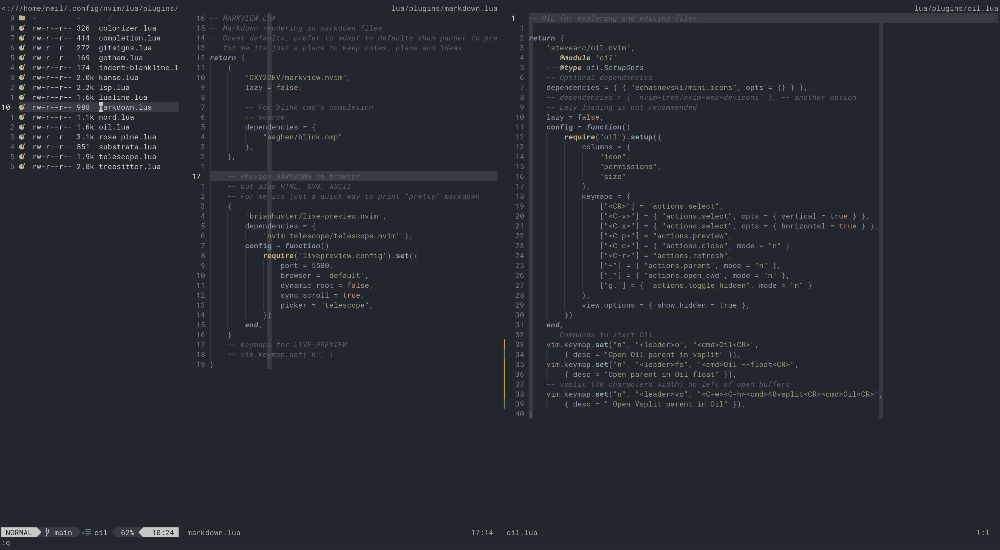
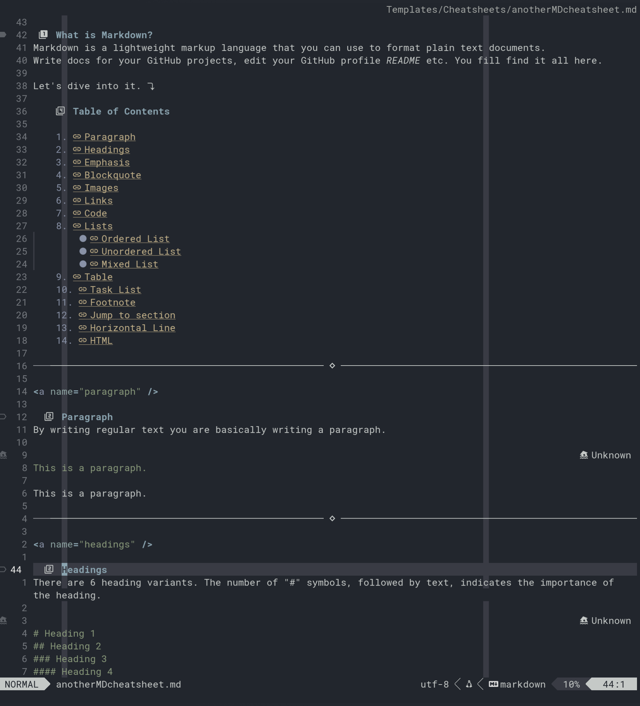

# nvim config in Lua
Neovim config files, simplified to take advantage of nvim r0.11 features in F42.

I'm not sure Neovim makes me faster, because "tinker-time".
But I do know that Neovim makes me happy, and that should count for something.

No UserName folder. Instead uses...
```lua
require(".lazy")
```
...in the init.lua file.

The dot before ".lazy" gives neat, logical structure without the eponymous folder.

Props to [TJ](https://github.com/tjdevries), [Prime](https://github.com/ThePrimeagen), [MrJakob](https://github.com/jakobwesthoff ) and others for ideas, keymaps and promoting a simpler setup.
New config focused on function over form, native over plugin.

Comments sufficient to avoid "why?" or "WTAF" in a year's time.

I used to use Neorg for notes, ideas and TODOs.
Switched to markdown, *standards based* format hopefully gives me portability.
Have started to use Preview as a simple means of printing.
Markview is well thought out and looks great.
I keep things very minimal.
I do intend to automate some actions like "create a new day file" or "list todo's that have a date".

I love [Oil.nvim](https://github.com/stevearc/oil.nvim) for file actions.
But I also like my file info to be a narrow vsplit on the left like Neotree and Nerdtree.
The solution is to shift cursor to left-most window and vsplit with expicit 40 width.

```lua
vim.keymap.set("n", "<leader>vo", "<C-w><C-h><cmd>40vsplit<CR><cmd>Oil<CR>",
    { desc = " Open Vsplit parent in Oil" }),
```
Still not found a way to "equalalways" the windows to the right.
Neovim Docs describe this as "complicated" but I refuse to give up!



I have recently switched to the [Kanso colorscheme](https://github.com/webhooked/kanso.nvim).
In the Mist variant, it gives me really nice Markdown colours and keeps things subtle for coding.
Whilst some people see signals in colours when coding, it *dazzles* me.
Is there a kind of dyslexia for colour?
There is probably a half decent PhD paper in "Colour Perception when coding".



Kanso also works well in the Ink variant at night.
I rarely use light colorschemes, but Saturated Mode in the Pearl variant is a reasonable option.

I use this [great markdown cheatsheet](https://github.com/im-luka/markdown-cheatsheet) for testing Markdown, it covers everything.


